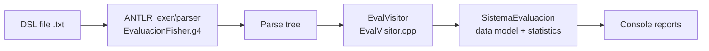

# antlr-cpp-statistical-interpreter

A C++17 interpreter, built with ANTLR 4, for a small Spanish-language domain-specific language (DSL) that describes construction-company employees and evaluates them: individual scores, rankings, group statistics, an F-ratio group comparison and a simple performance prediction.

Versión en español: [README.es.md](README.es.md)

> University course project (Universidad Peruana de Ciencias Aplicadas, UPC).

## Problem

Performance reviews in construction firms are often subjective. The DSL lets a non-programmer write employees, groups and evaluations in a readable syntax, and a compiler front end parses it and computes comparable statistics.

## Approach



- **Grammar:** `src/grammar/EvaluacionFisher.g4` defines employees (`empleado`), groups (`grupo`), criteria, evaluations (`evaluar`) and the queries `consultar`, `ranking`, `estadisticas`, `predecir` and `fisher(...)`. It supports `//`, `#` and `/* */` comments.
- **Visitor:** `EvalVisitor.cpp` walks the parse tree and builds an in-memory model (employees, groups, evaluations); `SistemaEvaluacion.cpp` computes means, standard deviations, rankings and group comparisons.
- **On the statistics:** the group comparison averages per-variable variance ratios (larger variance / smaller variance) and maps the result to approximate significance labels with hard-coded thresholds; the performance prediction thresholds an employee's mean score. These are descriptive heuristics, not a full Fisher discriminant analysis or a formal F-test (listed as future work).

## Example

A DSL program (excerpt from `src/demo_simple.txt`):

```text
empleado ingeniero_principal {
    nombre: "Pedro Gómez"
    cargo: ingeniero
    experiencia: 12 anos
    area: estructural
    rendimiento: alto
}

evaluar ingeniero_principal {
    productividad: 4.9
    calidad_trabajo: 4.8
    seguridad_laboral: 4.8
}

ranking por productividad limite 3
estadisticas
predecir rendimiento de ingeniero_principal
```

## Tech stack

C++17, ANTLR 4.12.0 (visitor pattern), CMake (FetchContent for the C++ runtime), Docker (clang 18, OpenJDK 17).

## How to run

The Docker image builds the ANTLR tool and places the jar in `/opt/antlr`, where `CMakeLists.txt` looks for it.

```bash
git clone https://github.com/Jaed69/antlr-cpp-statistical-interpreter.git
cd antlr-cpp-statistical-interpreter
docker compose up -d --build        # container "cpp_antlr_env"
docker exec -it cpp_antlr_env bash
mkdir -p build && cd build && cmake .. && make
./mi_interprete ../src/demo_simple.txt
```

Other sample inputs in `src/`: `test_minimal.txt`, `test_completo.txt`, `test_fisher_avanzado.txt`, `ejemplo_evaluacion.txt`. They are DSL programs run by hand; the repository has no automated test suite or CI.

## Project structure

```
src/grammar/EvaluacionFisher.g4   ANTLR grammar
src/EvalVisitor.{h,cpp}           parse-tree visitor
src/SistemaEvaluacion.{h,cpp}     domain model + statistics
src/main.cpp                      entry point
src/*.txt                         sample DSL programs
CMakeLists.txt, Dockerfile, docker-compose.yml
```

## Roadmap

True Fisher linear discriminant analysis, CSV/JSON export, automated tests, CI.

## Team

Course team project. The original Spanish README credits:

- Jhamil Peña ([@Jaed69](https://github.com/Jaed69)): initial development and architecture (all commits in this repository).
- Mireya Nicole Sihuincha Schermuly ([@sowiexsker894](https://github.com/sowiexsker894)): development and testing.
- Lizbeth Olivera Alvarez ([@Lizbeth851](https://github.com/Lizbeth851)): development and documentation.

The earlier course report and Python prototype live in [Fisher_All](https://github.com/Jaed69/Fisher_All).

## License

No license file is included in this repository.
